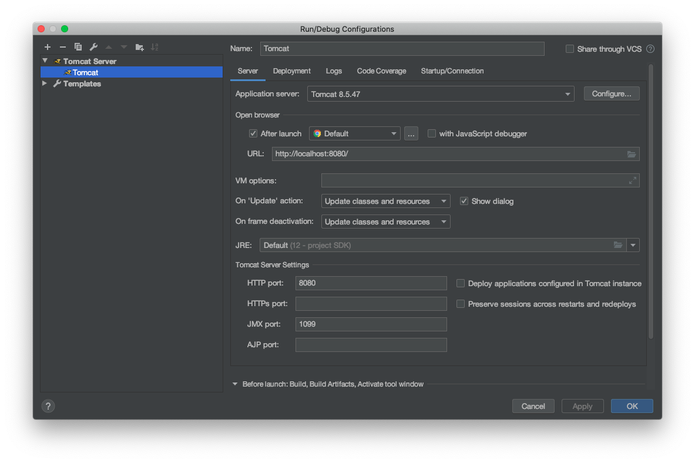
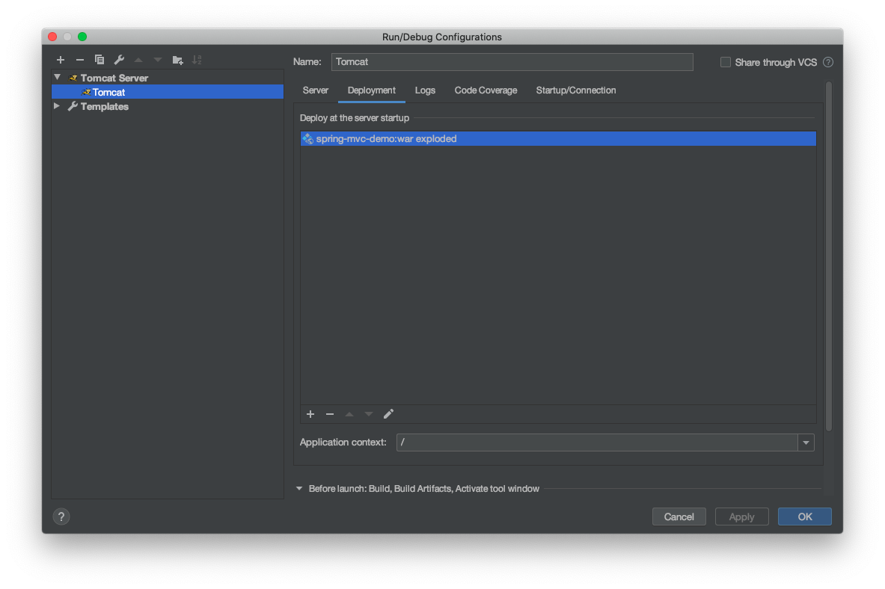

# Spring MVC Demo

This module serves as a basic demo of a Spring MVC application.

In IntelliJ IDEA, the Run/Debug Configuration settings should be as follows:

Please note that Tomcat 10 or later will give `java.lang.NoClassDefFoundError: javax/servlet/ServletContextListener` error.
Use Tomcat 9 or earlier to avoid this issue.