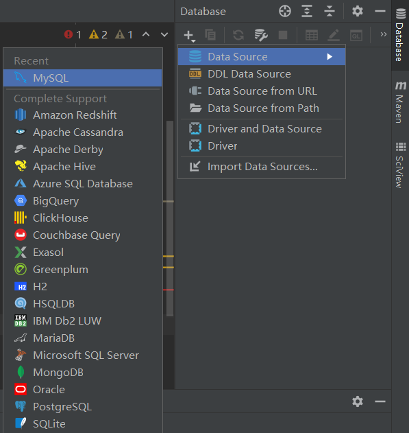

# Spring Boot MySQL Demo

This module serves as a basic demo for connecting to MySQL.

There are two controllers. `StudentController` directly talks to `JdbcTemplate`. 
`UserController` uses `UserRepository` (based on `CrudRepository`) to handle CRUD operations.

## Start MySQL Docker Container

Before running this demo, please install [Docker](https://docs.docker.com/engine/install/)
and start MySQL Docker container: 

```bash
# download docker image
> docker pull mysql
# run docker container
> docker run -itd --name mysql -p 3306:3306 -e MYSQL_ROOT_PASSWORD=root mysql
```

To stop and start the container, run the following:

```bash
# stop
> docker stop mysql
# start
> docker start mysql
```

You can also manage the containers in Docker Desktop.

## Add `test` Database

Next, let's add a database. Go into the container first
(you can also use a MySQL client such as [Beekeeper Studio](https://www.beekeeperstudio.io/) or [DBeaver](https://dbeaver.io/)):

```bash
> docker exec -it mysql mysql -u root -p
```

Enter the password (defined as `root` above) and then create the database:

```
mysql> create database test;
Query OK, 1 row affected (0.01 sec)
```

## Add Data into Database

This will be done automatically when starting this application. 
Please note that this will reset `test.student` and `test.user` tables.

After filling the tables, you can take a look at the data directly in IntelliJ:




